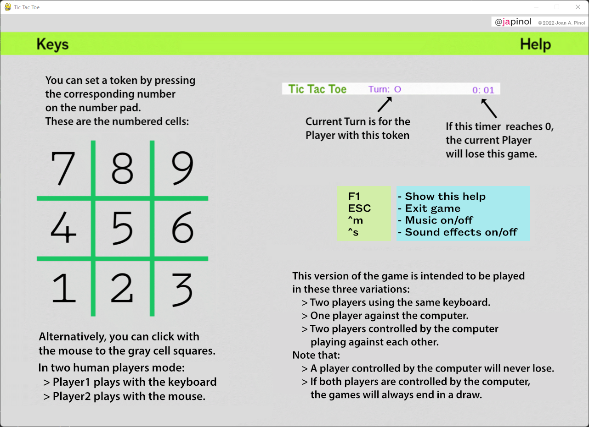

## Tic Tac Toe
    This version of the game is intended to be played in these three variations:
       > One player against the computer. 
       > Two players controlled by the computer playing against each other.
       > Two players using the same keyboard and mouse.
    Note that: 
       > A player controlled by the computer will never lose.
       > If both players are controlled by the computer, the games will always end in a draw.

   * The program 

	program: Tic Tac Toe.
    name as a package: tictactoe 
	version: 0.0.2
	author: Joan A. Pinol
	author_nickname: japinol
	author_gitHub: japinol7
	author_twitter: @japinol
	requirements: pygame
	Python requires: 3.9 or greater.
	Python versions tested: 
        > 3.9.12 64bits under Windows 11

## Rules and user guide

	> Each app execution is considered a campaign, which consists in N tournaments.
    > The player who wins more tournaments wins the campaign. 
	    > A tournament consists of X games (2 by default)
    > Only the tournaments score count in the end.
    > Players always have the same tokens.
    > The two players alternate turns on a game.
    > Which player starts a game:
	    > Player 1 has the first turn on the first game.
	    > For next games, the two players alternate the first turns.
	    > So, to be fair, each tournament should consist in an even number of games.
    > To win this Tic Tac Toe game:
	    > You must have more tournament victories than the other player.

## Computer Controlled Players. Additional info

Computer Controlled Players use a simple version of the Minimax decision rule algorithm.

* You can find good info about Minimax here:
  [Wikipedia Minimax search](https://en.wikipedia.org/wiki/Minimax)

## Keyboard keys
       F1:    show a help screen while playing the game
       1-9:   set a token to the board at the corresponding position:
                7 | 8 | 9
                4 | 5 | 6
                1 | 2 | 3
    <mouse L> set a token to the board clicking on a square gray cell
       ESC:   exit game
       ^m:    pause/resume music
       ^s:    sound effects on/off
       L_Alt + R_Alt + Enter: change full screen / windowed screen mode
       ^h:    shows this help to the console

    > Additional keys for debug mode:
       ^d:    print debug information to the console and the log file

## Screenshots

  
  
  

## Usage

	tictactoe  usage: tictactoe [-h] [-a] [-g GAMESTOPLAY] [-u TOURNAMENTS] [-l]  
                                [-m] [-n] [-o] [-p] [-s TURNMAXSECS] [-w] [-d] [-t]
	
	optional arguments:
	  -h, --help            show this help message and exit.
	  -a, 			--auto
	                        Auto mode. It does not stop between games or tournaments.
	                        Only when it needs a user input
	  -g, 			--gamestoplay GAMESTOPLAY
	                        Games to play on each tournament. Must be between 2 and 5000.
	  -u, 			--tournaments TOURNAMENTS
	                        Tournaments to play.  Must be between 1 and 30.
	  -l, 			--multiplelogfiles
	                        A log file by app execution, instead of one unique log file.
	  -m, 			--stdoutlog
	                        Print logs to the console along with writing them to the log file.
	  -n, 			--nologdatetime
	                        Logs will not print a datetime.
	  -o, 			--player1ai
	                        Player 1 will be controlled by the computer.
	  -p, 			--player2human
	                        Player 2 will be controlled by a human player.
	  -s, 			--turnmaxsecs TURNMAXSECS
	                        Turn max seconds before the player who holds the turn 
	                        loses the current game. Must be between 5 and 900.
	  -w, 			--wargametraining
	                        War game training speculating on playing Tic Tac Toc. It activates the following flags: 
	                        player1ai, auto, tournaments 1, gamestoplay 500.
	  -d, 			--debug
	                        Debug actions when pressing the right key, information and traces.
	  -t, 			--debugtraces
	                        show debug back traces information when something goes wrong.

**Default optional arguments**

	auto                False
	gamestoplay         2
	tournaments         10
	player1ai           False
	player2human        False
	turnmaxsecs         15
	multiplelogfiles    False
	stdoutlog           False
	nologdatetime       False
    debug               False
	debugtraces         False

**Examples of usage**

    > Modality One player against the computer:
       $ python -m tictactoe
    > Modality Two players using the same keyboard and mouse:
       $ python -m tictactoe --player2human
    > One player against the computer in auto mode. It will play 1 tournament of 4 games.
       $ python -m tictactoe --tournaments 1 --games 4 --auto
    > One player against the computer ommitting datetime in the log file.
       $ python -m tictactoe --nologdatetime
    > Two players controlled by the computer playing against each other without waiting between games.
       $ python -m tictactoe --player1ai --auto

**To make Tic Tac Toe work**

	Do this:
	    1. Clone this repository in your local system.
	    2. Go to its folder in your system.
	    3. $ pip install -r requirements.txt
	    4. $ python -m tictactoe
